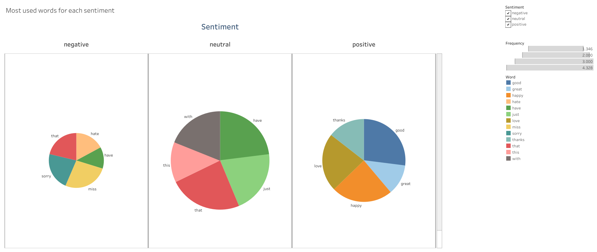

# Sentiment Analysis of Twitter Data: A Machine Learning Approach
In this project, I performed sentiment analysis on a dataset of 23k tweets that were previously labeled as neutral, positive, or negative. I trained a Naive Bayes model to classify tweets based on their sentiment, and also extracted the most commonly used words for each sentiment category. Although I attempted to train the model on a larger dataset of 690k tweets, the processing power of my Jupyter environment was insufficient. I created a Tableau visualization to display the most significant words associated with each sentiment category. The model's accuracy is not particularly high, which is not surprising given the inherent complexity of language and the limited size of the training data. Nevertheless, this project represents an important step towards building more robust models for sentiment analysis on social media platforms.

